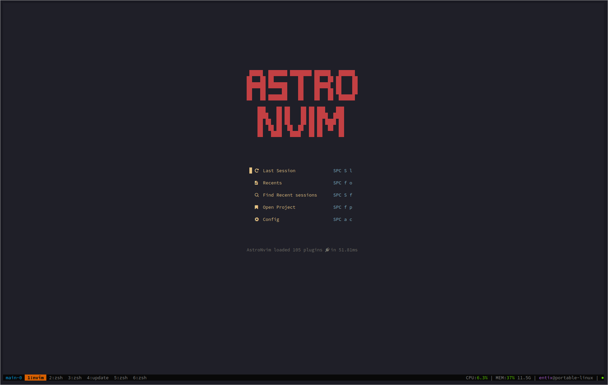
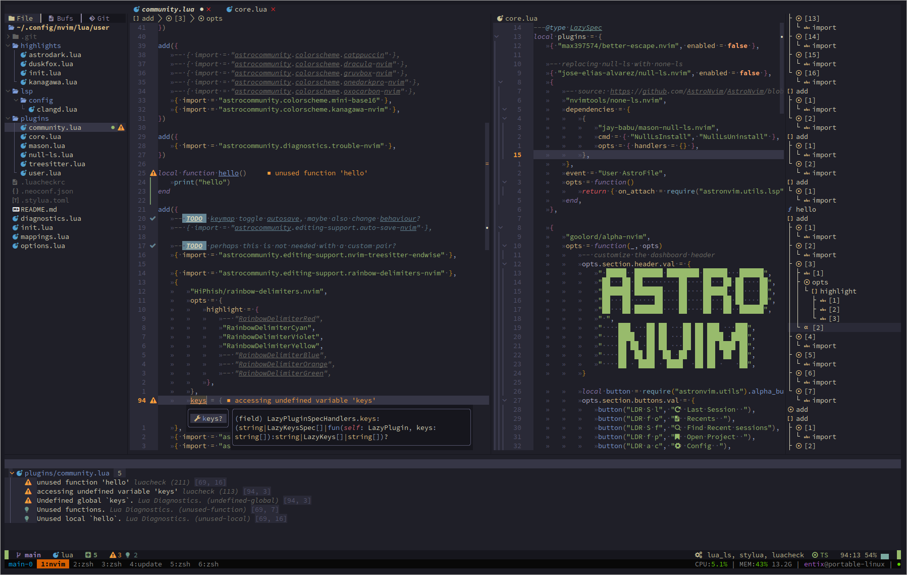

# AstroNvim

My [AstroNvim](https://github.com/AstroNvim/AstroNvim) configuration Based on
the user configuration template.

## Preview

 

<!-- TODO: requirements
## Requirements
- cargo
- node
- lua
- deno
...

### Archlinux

```shell
sudo pacman -S
``` -->

## 🛠️ Installation

### Make a backup of your current nvim and shared folder

```shell
mv ~/.config/nvim ~/.config/nvim.bak
mv ~/.local/share/nvim ~/.local/share/nvim.bak
```

### Clone AstroNvim

```shell
git clone https://github.com/AstroNvim/AstroNvim "${XDG_CONFIG_HOME:-${HOME}/.config}/nvim"
```

### Clone my configuration

```shell
git clone https://github.com/manuuurino/astronvim_config "${XDG_CONFIG_HOME:-${HOME}/.config}/nvim/lua/user"
```

### Try it in a docker container

> Some languages wont work, and it is expected, because they require some
> binaries. To keep it simpler, it installs a handfull only, you could add more
> if you like.

<!-- credits: https://github.com/AstroNvim/docs/blob/8646dd525c476fdb7429c310f4ff8018bf2f285f/src/content/docs/index.mdx#L106-L114 -->

```shell
docker run -w /root -it --rm alpine:edge sh -uelic '
  apk add bash git lua nodejs npm lazygit bottom python3 go neovim ripgrep alpine-sdk gzip cargo --update
  git clone --depth 1 https://github.com/AstroNvim/AstroNvim ~/.config/nvim
  git clone https://github.com/manuuurino/astronvim_config ~/.config/nvim/lua/user
  nvim --clean -c "set spelllang=en_us,de_de spell" -c "quit"
  nvim && bash
'
```
